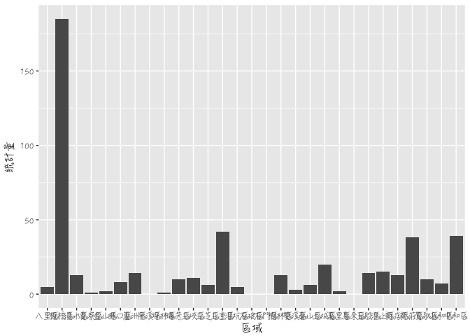

期末專題的分析問題
================

分析議題背景
------------

台灣新北市人口漸漸面臨老化的情形和殯葬業的崛起，但不見得每個地方都有足量的殯葬業數量來提供服務，會造成供不應求的情況，所以說人口密高、年齡層較高的地方相對來說會比較有需求？

分析動機
--------

在新北市不是每個地區都有殯葬業者，每個區域的人口數差異許多，人口密度高的地區不一定有足夠的殯葬業者能夠負荷，人口密度低的地方或許有很多家，所以藉由這樣的分析來找出到底哪些地方需要增加或哪些地方有多餘殯葬業者。

使用資料
--------

政府資料開放平臺：新北市各鄉鎮市區人口密度、新北市殯葬禮儀公司。 內政資料開放平臺：村里戶數、單一年齡人口。

載入使用資料們

``` r
library(readr)
company<- read_csv("~/Desktop/新北市殯葬禮儀公司_0002700676345301609834.csv")
```

    ## Parsed with column specification:
    ## cols(
    ##   district = col_character(),
    ##   title = col_character(),
    ##   person_in_charge = col_character(),
    ##   address = col_character(),
    ##   memo_date = col_character(),
    ##   memo_no = col_character(),
    ##   tel = col_character(),
    ##   remark = col_character(),
    ##   description = col_character()
    ## )

``` r
Populationdensity <- read_csv("~/Desktop/新北市人口密度.xls", 
    skip = 1)
```

    ## Parsed with column specification:
    ## cols(
    ##   統計年 = col_integer(),
    ##   區域別 = col_character(),
    ##   年底人口數 = col_character(),
    ##   土地面積 = col_double(),
    ##   人口密度 = col_character()
    ## )

``` r
data<- read_csv("~/Desktop/opendata10503M030.csv.xls", 
    skip = 1)
```

    ## Parsed with column specification:
    ## cols(
    ##   .default = col_integer(),
    ##   區域別 = col_character(),
    ##   村里 = col_character()
    ## )

    ## See spec(...) for full column specifications.

資料處理與清洗
--------------

整理表單欄位名稱，將xml

處理資料

``` r
library(dplyr)
```

    ## 
    ## Attaching package: 'dplyr'

    ## The following objects are masked from 'package:stats':
    ## 
    ##     filter, lag

    ## The following objects are masked from 'package:base':
    ## 
    ##     intersect, setdiff, setequal, union

``` r
library(magrittr)
colnames(company)<-c("區域別","公司名稱","負責人","地址","發文日期","發文字號","聯絡電話")
table(company$區域別)
```

    ## 
    ## 八里區 板橋區 淡水區 貢寮區 金山區 林口區 蘆洲區 坪林區 瑞芳區 三峽區 
    ##      5    185     13      1      2      8     14      1     10     11 
    ## 三芝區 三重區 深坑區 樹林區 雙溪區 泰山區 土城區 萬里區 五股區 汐止區 
    ##      6     42      5     13      3      6     20      2     14     15 
    ## 新店區 新莊區 鶯歌區 永和區 中和區 
    ##     13     38     10      7     39

``` r
a <- as.data.frame(table(company$區域別))
newtaipeicity <- Populationdensity[grepl("新北市",Populationdensity$區域別),]
newtaipeicity$區域 <- substr(newtaipeicity$區域別, start=4,stop=6)
colnames(a)<-c("區域","統計量")
merge1 <- full_join(newtaipeicity,a,by="區域")
```

    ## Warning in full_join_impl(x, y, by$x, by$y, suffix$x, suffix$y): joining
    ## factor and character vector, coercing into character vector

探索式資料分析
--------------

圖文並茂圖文並茂

``` r
library(ggplot2)
count <- table(merge1$統計量)
barplot(count, xlab = "區域別", ylab = "統計量", main ="殯葬業在各區的數量",density = 5)
```



期末專題分析規劃
----------------

假設人口密度高的地方殯葬業者也會多，然後各區域的土地面積大小會影像殯葬業者的數量。
