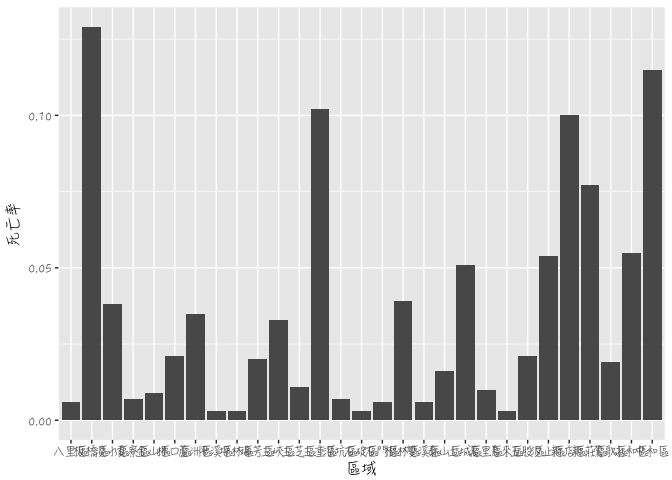

殯葬業的存在感
================

組員名稱：李冠昕、謝晟晧。

分析議題背景
------------

台灣新北市人口漸漸面臨老化的情形和殯葬業的崛起，但不見得每個地方都有足量的殯葬業數量來提供服務，會造成供不應求的情況，所以說人口密高、年齡層較高的地方相對來說會比較有需求？

分析動機
--------

在新北市不是每個地區都有殯葬業者，每個區域的人口數差異許多，人口密度高的地區不一定有足夠的殯葬業者能夠負荷，人口密度低的地方或許有很多家，所以藉由這樣的分析來找出到底哪些地方需要增加或哪些地方有多餘殯葬業者。

使用資料
--------

政府資料開放平臺：新北市各鄉鎮市區人口密度、新北市殯葬禮儀公司。 內政資料開放平臺：村里戶數、單一年齡人口。

載入使用資料們

``` r
library(readr)
company<- read_csv("~/Desktop/新北市殯葬禮儀公司_0002700676345301609834.csv")
```

    ## Parsed with column specification:
    ## cols(
    ##   district = col_character(),
    ##   title = col_character(),
    ##   person_in_charge = col_character(),
    ##   address = col_character(),
    ##   memo_date = col_character(),
    ##   memo_no = col_character(),
    ##   tel = col_character(),
    ##   remark = col_character(),
    ##   description = col_character()
    ## )

``` r
Populationdensity <- read_csv("~/Desktop/新北市人口密度.xls", 
    skip = 1)
```

    ## Parsed with column specification:
    ## cols(
    ##   統計年 = col_integer(),
    ##   區域別 = col_character(),
    ##   年底人口數 = col_character(),
    ##   土地面積 = col_double(),
    ##   人口密度 = col_character()
    ## )

``` r
data<- read_csv("~/Desktop/opendata10503M030.csv.xls", 
    skip = 1)
```

    ## Parsed with column specification:
    ## cols(
    ##   .default = col_integer(),
    ##   區域別 = col_character(),
    ##   村里 = col_character()
    ## )

    ## See spec(...) for full column specifications.

``` r
data1 <- read_csv("~/Downloads/新北市各區戶籍登記人數統計表_0005410544578435862195.csv")
```

    ## Parsed with column specification:
    ## cols(
    ##   District = col_character(),
    ##   `Moving-in` = col_integer(),
    ##   `Moving-out` = col_integer(),
    ##   Birth = col_integer(),
    ##   Death = col_integer(),
    ##   `Marriage Registration` = col_integer(),
    ##   `Divorce Registration` = col_integer()
    ## )

``` r
X123 <- read_csv("~/Desktop/123.csv")
```

    ## Parsed with column specification:
    ## cols(
    ##   年份 = col_integer(),
    ##   平均國民所得 = col_integer()
    ## )

``` r
X234 <- read_csv("~/Desktop/234.csv")
```

    ## Parsed with column specification:
    ## cols(
    ##   區域別 = col_character(),
    ##   家戶平均所得 = col_integer()
    ## )

``` r
monthdead <- read_csv("~/Desktop/各月死亡人數.csv")
```

    ## Parsed with column specification:
    ## cols(
    ##   年份 = col_integer(),
    ##   月 = col_integer(),
    ##   死亡人數 = col_integer()
    ## )

資料處理與清洗
--------------

整理表單欄位名稱，將xml

處理資料

``` r
library(dplyr)
```

    ## 
    ## Attaching package: 'dplyr'

    ## The following objects are masked from 'package:stats':
    ## 
    ##     filter, lag

    ## The following objects are masked from 'package:base':
    ## 
    ##     intersect, setdiff, setequal, union

``` r
library(magrittr)
colnames(company)<-c("區域別","公司名稱","負責人","地址","發文日期","發文字號","聯絡電話")
table(company$區域別)
```

    ## 
    ## 八里區 板橋區 淡水區 貢寮區 金山區 林口區 蘆洲區 坪林區 瑞芳區 三峽區 
    ##      5    185     13      1      2      8     14      1     10     11 
    ## 三芝區 三重區 深坑區 樹林區 雙溪區 泰山區 土城區 萬里區 五股區 汐止區 
    ##      6     42      5     13      3      6     20      2     14     15 
    ## 新店區 新莊區 鶯歌區 永和區 中和區 
    ##     13     38     10      7     39

``` r
a <- as.data.frame(table(company$區域別))
newtaipeicity <- Populationdensity[grepl("新北市",Populationdensity$區域別),]
newtaipeicity$區域 <- substr(newtaipeicity$區域別, start=4,stop=6)
colnames(a)<-c("區域","統計量")
merge1 <- full_join(newtaipeicity,a,by="區域")
```

    ## Warning in full_join_impl(x, y, by$x, by$y, suffix$x, suffix$y): joining
    ## factor and character vector, coercing into character vector

``` r
colnames(data1)<-c("區域","遷入","遷出","出生","死亡","結婚對","離婚對數")
newdata<-subset(data[grepl("新北市",data$區域別),])
data1 <- data1[-30,]#刪除不需要的第三十列資料
data1<-subset(data1, select = c(-遷入, -遷出,-結婚對,-離婚對數))
data1<-subset(data1, select = c(-出生))
data1$死亡總數<-1962
data1$死亡率<-round(data1$死亡/data1$死亡總數,3)
data1<-subset(data1, select = c(-死亡總數,-死亡))
newdata1<-as.data.frame(data)

aa<-group_by(newdata,區域別)%>%
    summarise(總人口數男=sum(`人口數-男`),總人口數女=sum(`人口數-女`))
     
merge2 <- full_join(aa,merge1,by="區域別")

aaa<-group_by(newdata,區域別)%>%
    summarise(`18歲以下`=sum(`0歲-男` ,`0歲-女`,`1歲-男`,`1歲-女`,`2歲-男` ,`2歲-女`,`3歲-男` ,`3歲-女`,`4歲-男` ,`4歲-女`,`5歲-男` ,`5歲-女`,`6歲-男` ,`6歲-女`,`7歲-男` ,`7歲-女`,`8歲-男` ,`8歲-女`,`9歲-男` ,`9歲-女`,`10歲-男` ,`10歲-女`,`11歲-男` ,`11歲-女`,`12歲-男` ,`12歲-女`,`13歲-男` ,`13歲-女`,`14歲-男` ,`14歲-女`,`15歲-男` ,`15歲-女`,`16歲-男` ,`16歲-女`,`17歲-男` ,`17歲-女`)
,`18歲~60歲`=sum(`18歲-男` ,`18歲-女`,`19歲-男`,`19歲-女`,`20歲-男` ,`20歲-女`,`21歲-男` ,`21歲-女`,`22歲-男` ,`22歲-女`,`23歲-男` ,`23歲-女`,`24歲-男` ,`24歲-女`,`25歲-男` ,`25歲-女`,`26歲-男` ,`26歲-女`,`27歲-男` ,`27歲-女`,`28歲-男` ,`28歲-女`,`29歲-男` ,`29歲-女`,`30歲-男` ,`30歲-女`,`31歲-男` ,`31歲-女`,`32歲-男` ,`32歲-女`,`33歲-男` ,`33歲-女`,`34歲-男` ,`34歲-女`,`35歲-男` ,`35歲-女`,`36歲-男` ,`36歲-女`,`37歲-男` ,`37歲-女`,`38歲-男` ,`38歲-女`,`39歲-男` ,`39歲-女`,`40歲-男` ,`40歲-女`,`41歲-男` ,`41歲-女`,`42歲-男` ,`42歲-女`,`43歲-男` ,`43歲-女`,`44歲-男` ,`44歲-女`,`45歲-男` ,`45歲-女`,`46歲-男` ,`46歲-女`,`47歲-男` ,`47歲-女`,`48歲-男` ,`48歲-女`,`49歲-男` ,`49歲-女`,`50歲-男` ,`50歲-女`,`51歲-男` ,`51歲-女`,`52歲-男` ,`52歲-女`,`53歲-男` ,`53歲-女`,`54歲-男` ,`54歲-女`,`55歲-男` ,`55歲-女`,`56歲-男` ,`56歲-女`,`57歲-男` ,`57歲-女`,`58歲-男` ,`58歲-女`,`59歲-男` ,`59歲-女`,`60歲-男` ,`60歲-女`),
`61歲~99歲`=sum(`61歲-男` ,`61歲-女`,`62歲-男`,`62歲-女`,`63歲-男` ,`63歲-女`,`64歲-男` ,`64歲-女`,`65歲-男` ,`65歲-女`,`66歲-男` ,`66歲-女`,`67歲-男` ,`67歲-女`,`68歲-男` ,`68歲-女`,`69歲-男` ,`69歲-女`,`70歲-男` ,`70歲-女`,`71歲-男` ,`71歲-女`,`72歲-男` ,`72歲-女`,`73歲-男` ,`73歲-女`,`74歲-男` ,`74歲-女`,`75歲-男` ,`75歲-女`,`76歲-男` ,`76歲-女`,`77歲-男` ,`77歲-女`,`78歲-男` ,`78歲-女`,`79歲-男` ,`79歲-女`,`80歲-男` ,`80歲-女`,`81歲-男` ,`81歲-女`,`82歲-男` ,`82歲-女`,`83歲-男` ,`83歲-女`,`84歲-男` ,`84歲-女`,`85歲-男` ,`85歲-女`,`86歲-男` ,`86歲-女`,`87歲-男` ,`87歲-女`,`88歲-男` ,`88歲-女`,`89歲-男` ,`89歲-女`,`90歲-男` ,`90歲-女`,`91歲-男` ,`91歲-女`,`92歲-男` ,`92歲-女`,`93歲-男` ,`93歲-女`,`94歲-男` ,`94歲-女`,`95歲-男` ,`95歲-女`,`96歲-男` ,`96歲-女`,`97歲-男` ,`97歲-女`,`98歲-男` ,`98歲-女`,`99歲-男` ,`99歲-女`))
ov <- data.frame(merge1)
ov[is.na(ov)] <- 0
cc<-sum(ov$統計量)
cc$平均值<-round(sum(ov$統計量)/29)
```

    ## Warning in cc$平均值 <- round(sum(ov$統計量)/29): 把公式左側強迫變成串列

``` r
merge3<- full_join(aaa,merge2,by="區域別")
ovnew<-full_join(merge1,data1,by="區域")
ovnew<-full_join(ov,data1,by="區域")

ovnew[is.na(ovnew)] <- 0
```

探索式資料分析
--------------

圖文並茂圖文並茂

``` r
merge4<- head(merge3[order(merge3$統計量,decreasing = T),],30)
library(ggplot2)
count <- table(merge4$統計量)
##barplot(count,xlab = "區域別",data = merge4, main ="殯葬業在各區的數量",family = "HanziPen TC Regular") 

merge4$區域 <- as.factor(merge4$區域)
ggplot()+geom_bar(data=merge4,aes(x=區域,y=統計量),stat = "identity") + theme(text=element_text(family = "HanziPen TC Regular"))
```

    ## Warning: Removed 4 rows containing missing values (position_stack).


``` r
library(dplyr)
library(magrittr)

ovnewfinal<-full_join(X234,ovnew,by="區域別")
ovnewfinal<-subset(ovnewfinal, select = c(-區域))
```

探索式資料分析
--------------

圖文並茂圖文並茂

``` r
library(ggplot2)
#data1$死亡率<-data1$死亡率*100
ggplot()+geom_bar(data=data1,aes(x=區域,y=死亡率),stat = "identity") + theme(text=element_text(family = "HanziPen TC Regular"))
```



``` r
library(ggplot2)
ggplot()+geom_bar(data=ovnew,aes(x=區域,y=as.numeric(人口密度)),stat = "identity") + theme(text=element_text(family = "HanziPen TC Regular"))
```


``` r
library(ggplot2)
ggplot(ovnew,
       aes(x=死亡率,
           y=統計量))+
  geom_point()+
  geom_smooth(method = "glm")+ theme(text=element_text(family = "HanziPen TC Regular"))
```


``` r
library(ggplot2)
ggplot(ovnew,
       aes(x=死亡率,
           y=as.numeric(人口密度)))+
  geom_point()+
  geom_smooth(method = "glm")+ theme(text=element_text(family = "HanziPen TC Regular"))
```

 \#\# 期末專題分析規劃 假設死亡率高的地方殯葬業者也會多，然後各區域的死亡率會影像殯葬業者的數量。

``` r
library(ggplot2)
ggplot()+geom_bar(data=X123,aes(x=年份,y=平均國民所得),stat = "identity") + theme(text=element_text(family = "HanziPen TC Regular"))
```


``` r
library(ggplot2)
ggplot(ovnew,
       aes(x=統計量,
           y=as.numeric(人口密度)))+
  geom_point()+
  geom_smooth(method = "glm")+ theme(text=element_text(family = "HanziPen TC Regular"))
```


``` r
library(ggplot2)
ggplot()+geom_bar(data=monthdead,aes(x=as.factor(月),y=死亡人數),stat = "identity") + theme(text=element_text(family = "HanziPen TC Regular"))
```


